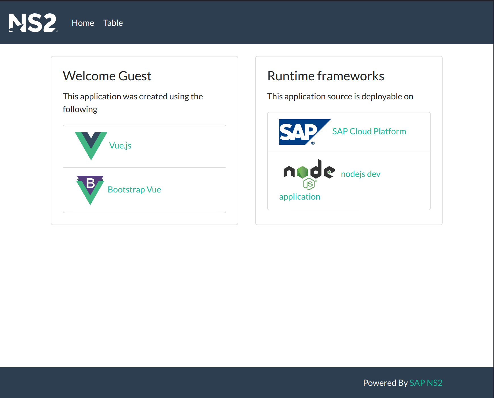

# seed-nginx-vue

Seed web application integrating [Vue](https://vuejs.org/) with [Bootswatch](https://bootswatch.com). Initial scafold done with Vue CLI. The project can be deployed  directly with a [buildpack](https://docs.cloudfoundry.org/buildpacks/nginx/index.html) to [SAP Cloud Platform](https://www.sap.com/products/cloud-platform.html)



## Integration and Links

* [Vue cli](https://cli.vuejs.org/) used to generate this project
* [Style Guide](https://vuejs.org/v2/style-guide/) for Vue. Attempting to follow as best as possible`
* [Bootswatch Flatly](https://bootswatch.com/flatly) theme
* [Bootstrap-Vue](https://bootstrap-vue.org/) components
* [Vue Router](https://router.vuejs.org/) for view management
* [vue-mobile-detection](https://github.com/ajerez/vue-mobile-detection) for checking mobile state
* [axios](https://github.com/axios/axios) as http client
* [jsonplaceholder](https://jsonplaceholder.typicode.com/) for sample table data

## Project setup
```
npm install
```

### Compiles and hot-reloads for development
```
npm run serve
```

### Compiles and minifies for production
```
npm run build
```

* The server will be running on [http://localhost:4200](http://localhost:4200)

## Deploy to SAP Cloud Platform

>You can create an account for free at [SAP Cloud Platform](https://www.sap.com/products/cloud-platform.html)

* Make sure you have the [Cloud Foundry Command Line Interface (cf CLI)](https://docs.cloudfoundry.org/cf-cli/) installed

* Update the `cf-login.sh` script with the values found in the SAP Cloud Foundry Cockpit. Then run the script to login.

```bash
cf-login.sh
```

### Buildpack

* Push your code directly without the need of a container registry with the following commands (make sure you have done a build ahead of time)


```bash
cf-push-buildpack.sh
```

* You will find a url to your deployed application in the SAP Cloud Platform Cockpit or you can query with the `cli`
```bash
cf app seed-nginx-vue
```

### Customize configuration
See [Configuration Reference](https://cli.vuejs.org/config/).
